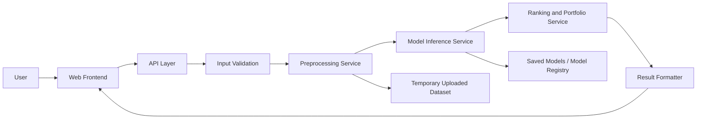

# AIFT Final Project

Stock-Selection Modeling, Backtesting, and Financial Data Crawling

本專案對應 AIFT Final Project 需求，目標是以年資料進行股票篩選建模、時間序列回測、風險衡量、外部財務資料爬取與重跑實驗，並保留可 demo 的執行流程。

## 1. Project Overview

本專案聚焦三個核心要求：

1. 使用決策樹模型完成股票篩選任務。
2. 使用另一種方法完成相同任務，並與 Task 1 進行比較。
3. 建立外部資料爬蟲，重建相似財務資料集，並重新執行選股流程。

專案的設計原則如下：

- 僅使用訓練期間資料建立模型，不使用未來測試資料。
- 將股票篩選結果轉換為可回測的投資組合績效。
- 除報酬外，同時評估最大回撤、波動度、Sharpe ratio 等風險指標。
- 保留 demo 模式，讓模型可以對新格式相同的測試資料進行預測。

## 2. Requirement Mapping

| 需求書項目 | 本專案對應實作 |
| --- | --- |
| 資料清理與移除 `年月 = 200912` | `prepare_data.py`, `src/preprocessing.py` |
| Temporal validation | `create_splits.py`, `src/validation.py` |
| Task 1: Decision Tree / ID3-like | `train_decision_tree.py`, `src/models.py`, `src/prediction.py` |
| Task 2: 第二模型 | `train_task2_models.py`, `train_svr_ga.py` |
| 投組建構與回測 | `build_portfolios.py`, `build_task2_portfolios.py`, `build_svr_ga_portfolios.py`, `src/portfolio.py` |
| 報酬與風險指標 | `src/metrics.py`, `src/benchmark.py` |
| Task 3: 財務資料爬蟲與重跑 | `run_external_crawler.py`, `rerun_external_pipeline.py`, `external_benchmark.py` |
| Demo requirement | 目前提供 CLI demo：`demo.py`, `src/demo_runner.py`, `main.py demo`；Web demo 為規劃中 |

## 3. Task Design

### Task 1: Decision Tree Stock Selection

Task 1 使用 entropy-based Decision Tree 作為 ID3-like 分類器，將每一筆 stock-year observation 分成：

- `ReturnMean_year_Label = 1`: 該股票報酬高於同年所有股票平均報酬
- `ReturnMean_year_Label = -1`: 否則

核心策略如下：

- 使用 16 個財務/價值特徵作為輸入。
- 以 `P(label = 1)` 作為選股分數。
- 每年依分數排序，選出 Top-K 股票形成投資組合。
- 輸出預測檔、分類指標、feature importance、決策樹規則與回測績效。

對應腳本：

- `train_decision_tree.py`
- `build_portfolios.py`

### Task 2: Alternative Models for the Same Stock-Selection Task

Task 2 的目的是用非決策樹方法解相同選股問題，並與 Task 1 比較。本專案包含兩條線：

- 分類模型比較：`logistic_regression`、`random_forest`、`gradient_boosting`
- 延伸方法：`SVR-GA`，先預測連續報酬，再依 `predicted_return` 排名選股

分類線策略：

- 仍以 `ReturnMean_year_Label` 為預測目標。
- 以 `score_label_1` 作為排序依據。
- 比較不同模型在分類品質與投組績效上的差異。

SVR-GA 線策略：

- 以 `Return` 為回歸目標。
- 使用 genetic algorithm 搜尋 SVR 的 `C / gamma / epsilon`。
- 依 `predicted_return` 由高到低選出 Top-K 股票。

對應腳本：

- `train_task2_models.py`
- `build_task2_portfolios.py`
- `train_svr_ga.py`
- `build_svr_ga_portfolios.py`
- `rebuild_all_models_portfolio_metrics.py`
- `generate_all_model_png.py`

### Task 3: Financial Data Crawling and Re-run

Task 3 使用外部資料來源重建相似的年度財務資料集，再重新執行股票篩選與回測流程。

本專案支援：

- FinMind 為主要資料來源
- yfinance 作為價格 fallback
- 價格、PER/PBR、月營收、財報、資產負債表等資料抓取
- 外部特徵重建、資料品質檢查、benchmark 比較與結果視覺化

外部資料策略重點：

- 以可公開取得的欄位近似原始 16 個特徵
- 無法直接重建的欄位，以 proxy feature 補足
- 對缺失率、可用性與特徵映射保留 metadata 與 quality report

對應腳本：

- `run_external_crawler.py`
- `rerun_external_pipeline.py`
- `external_benchmark.py`
- `compare_external_benchmarks.py`
- `generate_external_figures.py`
- `build_external_metadata.py`

## 4. End-to-End Strategy

專案完整流程如下：

1. 原始資料清理  
   標準化欄名、修正 `年月`、移除 `200912`、轉換數值欄位、建立 `year` 欄位、檢查 label 與 return 合法性。

2. Temporal validation 建立  
   同時建立兩種 split：
   - `next_year`: 擴張式單年 out-of-sample 測試
   - `remaining_years`: 更貼近課堂 TV 圖的「訓練早期年份、測試剩餘所有未來年份」

3. 模型訓練  
   各 split 只使用歷史資料 fit model、imputer 與 scaler，不使用未來測試資料。

4. 股票排序與 Top-K 選股  
   - 分類模型：依 `score_label_1` 排序
   - SVR-GA：依 `predicted_return` 排序

5. 投資組合建構  
   使用 annual rebalancing，支援：
   - equal-weight
   - score-weighted

6. 績效與風險衡量  
   至少包含：
   - Annualized return
   - Cumulative return
   - Maximum drawdown

   並額外提供：
   - Volatility
   - Sharpe ratio
   - Win rate

7. Benchmark 比較  
   比較對象包含：
   - all-stock equal-weight benchmark
   - random Top-K benchmark
   - external benchmark alignment

## 5. Repository Structure

```text
proj3/
├─ data/
│  ├─ raw/
│  │  └─ top200.xlsx
│  ├─ processed/
│  │  ├─ cleaned_top200.csv
│  │  ├─ temporal_splits_next_year.csv
│  │  └─ temporal_splits_remaining_years.csv
│  └─ external/
│     ├─ tickers.csv
│     ├─ raw/
│     ├─ processed/
│     └─ metadata/
├─ outputs/
│  ├─ predictions/
│  ├─ metrics/
│  ├─ selections/
│  ├─ portfolio/
│  ├─ benchmarks/
│  ├─ figures/
│  ├─ logs/
│  └─ external/
├─ src/
│  ├─ config.py
│  ├─ schema.py
│  ├─ data_loader.py
│  ├─ preprocessing.py
│  ├─ validation.py
│  ├─ models.py
│  ├─ prediction.py
│  ├─ portfolio.py
│  ├─ metrics.py
│  ├─ benchmark.py
│  ├─ svr_ga.py
│  ├─ visualization.py
│  ├─ demo_runner.py
│  └─ external/
├─ prepare_data.py
├─ create_splits.py
├─ train_decision_tree.py
├─ build_portfolios.py
├─ train_task2_models.py
├─ build_task2_portfolios.py
├─ train_svr_ga.py
├─ build_svr_ga_portfolios.py
├─ run_external_crawler.py
├─ rerun_external_pipeline.py
├─ external_benchmark.py
├─ compare_external_benchmarks.py
├─ generate_external_figures.py
├─ build_external_metadata.py
├─ generate_all_model_png.py
├─ demo.py
├─ main.py
└─ requirements.txt
```

## 6. Key Modules

| 模組 | 功能 |
| --- | --- |
| `src/config.py` | 專案路徑、模型參數、交易成本、輸出位置設定 |
| `src/schema.py` | 欄位 schema 與 canonical feature list |
| `src/preprocessing.py` | 原始資料清理、欄名標準化、型別轉換、資料檢查 |
| `src/validation.py` | temporal split 建立與 leakage 檢查 |
| `src/models.py` | Decision Tree、LR、RF、GB pipeline 定義 |
| `src/prediction.py` | 各模型逐 split 訓練、預測與 feature importance 輸出 |
| `src/svr_ga.py` | SVR-GA 搜尋與回歸模型管線 |
| `src/portfolio.py` | Top-K 選股、權重計算、投組年報酬計算 |
| `src/metrics.py` | 分類指標、回歸指標、投組績效與風險指標 |
| `src/benchmark.py` | all-stock 與 random Top-K benchmark |
| `src/visualization.py` | 各任務圖表與比較圖 |
| `src/demo_runner.py` | 新測試資料的 demo 預測流程 |
| `src/external/*` | 外部資料抓取、proxy 特徵工程與資料集重建 |

## 7. Environment and Installation

建議環境：

- Python 3.10+

安裝方式：

```bash
pip install -r requirements.txt
```

Task 3 若要啟用 yfinance fallback，請額外安裝：

```bash
pip install yfinance
```

若要使用 FinMind API，請設定 token：

```bash
set FINMIND_TOKEN=your_token_here
```

或在 PowerShell：

```powershell
$env:FINMIND_TOKEN="your_token_here"
```

## 8. How to Run

### 8.1 Core Pipeline

1. 資料清理

```bash
python prepare_data.py
```

2. 建立 temporal validation splits

```bash
python create_splits.py
```

3. Task 1: 訓練 Decision Tree

```bash
python train_decision_tree.py
```

4. Task 1: 建立投組與 benchmark

```bash
python build_portfolios.py
```

5. Task 2: 訓練分類模型

```bash
python train_task2_models.py
```

6. Task 2: 建立投組

```bash
python build_task2_portfolios.py
```

7. Task 2 extension: 訓練 SVR-GA

```bash
python train_svr_ga.py
```

8. Task 2 extension: 建立 SVR-GA 投組

```bash
python build_svr_ga_portfolios.py
```

9. 重建 all-model comparison metrics

```bash
python rebuild_all_models_portfolio_metrics.py
```

10. 產生 all-model comparison 圖表

```bash
python generate_all_model_png.py
```

### 8.2 Task 3: External Data Pipeline

1. 抓取外部資料並重建外部資料集

```bash
python run_external_crawler.py --source finmind --use-cache
```

2. 在外部資料上重跑模型與投組

```bash
python rerun_external_pipeline.py
```

3. 建立外部 benchmark

```bash
python external_benchmark.py
```

4. 對齊外部 benchmark 並比較

```bash
python compare_external_benchmarks.py
```

5. 產生外部圖表

```bash
python generate_external_figures.py
```

6. 產生 external metadata 與 data quality reports

```bash
python build_external_metadata.py
```

### 8.3 Demo Mode (CLI)

CLI demo 可驗證模型能否處理同格式的新測試資料。

對新測試資料執行 demo：

```bash
python demo.py --input path/to/new_testing_data.xlsx --model random_forest --top-k 10
```

也可透過統一入口：

```bash
python main.py demo --input path/to/new_testing_data.xlsx --model random_forest --top-k 10
```

如果新資料含有 `Return` / `ReturnMean_year_Label`，demo 會額外輸出投組報酬與績效；若沒有，則至少輸出預測與選股結果。

### 8.4 Web Demo

Web demo 將 CLI demo 包裝成可上傳檔案、選模型、線上推論並顯示結果的單頁介面
（FastAPI 薄 API 層 + 既有 `src/` 分析模組，實作於 `webapp/`）。

啟動：

```bash
python run_webapp.py            # http://127.0.0.1:8000
python run_webapp.py --port 8888
```

開啟瀏覽器進入 `http://127.0.0.1:8000`，流程：

1. 上傳 `.xlsx` / `.csv` 測試資料（需含「證券代碼」「年月」）。
2. 選擇分類模型、Top-K 與**推論策略**。
3. 按「開始分析」，後端推論。
4. 頁面顯示：摘要卡片、Top-K 選股表、完整預測表；若資料含真實 `Return`，另顯示投組績效與分類品質指標；可下載預測 CSV。

推論策略（對應第 15.8 節）：

- **策略 B · 即時重訓**（預設 fallback）：依 demo 年份，用該年以前的歷史 cleaned data 即時重新訓練後推論。不依賴 `saved_models/`。
- **策略 A · 載入預訓練模型**：直接載入 `saved_models/` 對應 split 的 `.joblib`（依 `test_year → split` 對應），免訓練、現場秒回。
  - 因為對應 split 的訓練資料與策略 B 完全相同（同 seed），兩者**選股與分數一致**，但策略 A 更快。
  - 涵蓋年份 1998–2008；不在範圍內的年份會自動 fallback 為即時重訓。
  - 需先執行 `train_decision_tree.py` / `train_task2_models.py` 產生模型檔；若 `saved_models/` 不完整，前端會自動停用策略 A。

可用 `data/demo_samples/` 內的範例檔測試：

- `sample_2008_with_return.csv`（含真實報酬，會顯示投組績效）
- `sample_2008_features_only.csv`（純特徵，只顯示預測與選股）

API（對應第 15.7 節）：

| Method | Path | Purpose |
| --- | --- | --- |
| `GET` | `/api/health` | 服務健康檢查 |
| `GET` | `/api/demo/models` | 可用模型列表 |
| `GET` | `/api/demo/schema` | 必要欄位與特徵欄位說明 |
| `GET` | `/api/demo/pretrained` | 預訓練模型可用情形（策略 A 是否可用、涵蓋年份）|
| `POST` | `/api/demo/run` | 上傳資料、指定模型 / Top-K / strategy，回傳推論結果 |

## 9. Main Output Files

| 類別 | 位置 |
| --- | --- |
| 清理後資料 | `data/processed/cleaned_top200.csv` |
| Temporal splits | `data/processed/temporal_splits_*.csv` |
| Task 1 predictions | `outputs/predictions/decision_tree_predictions.csv` |
| Task 2 predictions | `outputs/predictions/task2_classification_predictions.csv` |
| SVR-GA predictions | `outputs/predictions/svr_ga_regression_predictions.csv` |
| 投組績效 | `outputs/portfolio/*.csv` |
| Benchmark | `outputs/benchmarks/*.csv` |
| 圖表 | `outputs/figures/**` |
| External outputs | `outputs/external/**` |
| Demo outputs | `outputs/demo/**` |

## 10. Modeling and Portfolio Assumptions

- 移除 `年月 = 200912`
- `Return` 為百分比值，投組計算時除以 `100`
- `ReturnMean_year_Label` 定義為是否高於同年平均報酬
- Top-K 設定：`[5, 10, 20, 30]`
- 調整頻率：annual rebalancing
- 部位限制：long-only, no short-selling, no leverage
- 權重方式：
  - `equal`
  - `score`
- 交易成本 round-trip：
  - buy fee = `0.0399%`
  - sell fee = `0.0399%`
  - sell tax = `0.3%`

## 11. Notes on Temporal Validation

本專案保留兩種 temporal validation 設計：

- `remaining_years`  
  更貼近需求書與課堂 TV 圖的概念：用較早年份訓練，測試所有剩餘未來年份。

- `next_year`  
  更適合逐年回測、年度投資期比較與投組績效對照，因此目前主要模型輸出與投組回測多使用此模式。

若要做嚴格的規格對齊報告，建議在書面報告中清楚說明兩者差異與用途。

## 12. Notes on Reproducibility

- `train_decision_tree.py`、`train_task2_models.py`、`train_svr_ga.py` 會在執行時輸出 `.joblib` 模型檔到 `saved_models/`
- 若 `saved_models/` 不存在，請重新執行對應訓練腳本
- Task 3 的外部特徵部分為 proxy reconstruction，與原始資料欄位定義可能不完全相同，已透過 metadata 與 quality report 進行說明

## 13. Deliverables Suggested by This Repository

本 repo 可支援下列交付物準備：

- Source code
- Word report 的方法、流程、結果與圖表來源
- Demo 展示時的可執行流程
- Task 3 的資料來源、特徵映射與外部實驗結果

若要正式繳交，建議搭配：

- 書面報告
- Demo PPT
- 最終整理後的 zip 檔

## 14. Unfinished Items and Recommended Next Steps

以下項目屬於目前專案中「尚未完全完成」或「已具備基礎，但仍建議補強」的部分。這些內容特別對應需求書中的規範符合度、可重現性與 demo 展示穩定性。

### 14.1 Temporal Validation 主結果尚未完全對齊需求書 TV 圖

現況：

- 專案已同時產生 `next_year` 與 `remaining_years` 兩種 temporal splits。
- 目前主要訓練、投組與比較結果多以 `next_year` 為主。

待補強方向：

- 補做一條以 `remaining_years` 為主的完整主實驗流程。
- 在報告中清楚區分：
  - `remaining_years` 用於對齊課堂 TV 規格
  - `next_year` 用於逐年投資期回測與 Top-K 投組分析
- 若時間允許，將兩種 validation 的結果並列表格化比較。

### 14.2 Saved Models 與可重現 artifact 仍需整理完整

現況：

- 訓練腳本具備輸出 `.joblib` 模型的能力。
- 若未重新執行訓練，`saved_models/` 可能不存在或不完整。

待補強方向：

- 重新執行各訓練腳本，確保每個 split 都有對應模型檔。
- 讓 `validate_decision_tree.py`、`validate_task2.py`、`validate_svr_ga.py` 能完整通過。
- 在最終繳交前確認：
  - model files
  - rules files
  - predictions
  - metrics
  - portfolio outputs
  - figures
  均能由程式重新生成。

### 14.3 Demo 前處理仍應與正式訓練流程完全對齊

現況：

- 專案已有可用的 CLI demo。
- 但 demo 的新資料前處理流程仍可進一步與正式訓練前處理完全統一。

待補強方向：

- 將 demo 的欄位清理、數值轉換、缺失處理規則與 `src/preprocessing.py` 再做一致化整理。
- 避免 demo 測試資料在遇到：
  - `%`
  - 千分位逗號
  - 欄名空白差異
  - `年月` 格式差異
  時，與主訓練流程出現不一致行為。
- 最理想的做法是將 demo preprocessing 與 training preprocessing 共用同一套函式邏輯。

### 14.4 Task 3 外部特徵仍有 proxy 性質，可持續精煉

現況：

- 已可從 FinMind / yfinance 重建外部資料集。
- 但部分欄位屬於 proxy feature，而非與原始課堂資料完全同義。

待補強方向：

- 逐欄檢查原始 16 features 與 external feature mapping 的語義差異。
- 優先補強下列類型欄位：
  - valuation ratios
  - growth rates
  - turnover ratios
  - profitability features
- 若可找到更接近原始定義的公開資料來源，可建立第二版 external dataset。
- 在報告中對 proxy 欄位明確標註其假設與限制。

### 14.5 報告與繳交物仍需補齊正式版本

現況：

- 本 repo 目前主要聚焦於 source code、結果輸出與可執行流程。
- Word report、Demo PPT、最終 zip 組織仍需另行完成。

待補強方向：

- 依需求書補齊下列報告章節：
  1. Problem definition and dataset description
  2. Data preprocessing and feature handling
  3. Decision-tree model design and results
  4. Second model design and results
  5. Web crawler design, data source, and re-run results
  6. Performance comparison and discussion
  7. Individual contribution of each group member
  8. What you learned from this project and this course
  9. Suggestions for improving the course
- 將 README、主要結果表、代表圖表與 demo 流程整理成 PPT。
- 最終將 source code、report、PPT 依繳交要求打包。

### 14.6 Web Demo 尚未實作，建議作為最終展示型態

現況：

- 目前已具備 CLI demo 流程。
- Web 介面尚未實作。

待補強方向：

- 將現有 demo pipeline 包裝為 Web 化的資料上傳、模型選擇、預測與視覺化流程。
- Web 版本不必一開始就涵蓋所有功能，建議先完成最核心的 demo 路徑：
  - 上傳檔案
  - 選擇模型
  - 執行推論
  - 顯示 Top-K 結果與績效摘要

## 15. Planned Web Demo Architecture

本節為 Web demo 規劃。目標是將目前 CLI demo 提升為更直觀、可展示、適合期末簡報現場操作的介面。

### 15.1 Web Demo Goals

- 讓使用者上傳與原始格式相同的新測試資料。
- 在頁面上選擇模型與 Top-K 參數。
- 執行推論並回傳：
  - 預測結果
  - 選股結果
  - 若資料含真實 `Return`，則回傳投組績效摘要
- 讓 demo 過程清楚呈現資料進入、模型推論、選股與績效解讀的完整鏈路。

### 15.2 Scope of the First Web Version

建議第一版只涵蓋最必要功能：

- Dataset upload
- Model selection
- Top-K selection
- Inference trigger
- Prediction table
- Selected stocks table
- Basic summary cards

以下功能可列為第二階段：

- 圖表互動化
- 多模型同時比較
- 外部資料 Task 3 線上重跑
- 使用者登入與歷史紀錄管理

### 15.3 Suggested User Flow

1. 使用者進入首頁。
2. 選擇 demo 模型。
3. 上傳 `.xlsx` 或 `.csv` 測試資料。
4. 系統先檢查欄位格式與必要欄位。
5. 驗證通過後，使用者按下「開始分析」。
6. 後端執行 preprocessing、prediction、Top-K ranking。
7. 頁面顯示：
   - 基本資料摘要
   - 預測結果表
   - Top-K 選股表
   - 若有真實報酬，則顯示投組績效摘要
8. 使用者可下載結果 CSV 或切換模型重新測試。

### 15.4 Suggested System Architecture



### 15.5 Frontend Design Proposal

建議前端頁面分成四個區塊：

1. Upload Panel  
   顯示檔案上傳元件、格式說明、欄位需求與驗證狀態。

2. Model Control Panel  
   讓使用者選擇：
   - `decision_tree_entropy`
   - `logistic_regression`
   - `random_forest`
   - `gradient_boosting`

   並設定：
   - `Top-K`
   - 是否輸出詳細預測表

3. Result Summary Panel  
   以卡片形式顯示：
   - 檔案筆數
   - 測試年份
   - 預測股票數
   - Top-K 清單
   - 若可評估則顯示 annualized return / cumulative return / max drawdown

4. Detailed Result Panel  
   顯示：
   - 預測表
   - 選股表
   - 投組績效表
   - 錯誤與警告訊息

### 15.6 Backend Layer Design

建議後端採用「薄 API 層 + 現有分析模組」的方式，避免重寫既有核心邏輯。

建議邏輯分層如下：

- API Layer  
  處理 HTTP request、回傳 JSON、管理任務狀態。

- Validation Layer  
  檢查欄位、格式、資料型態與檔案大小。

- Preprocessing Layer  
  將 Web upload 的資料整理成與 CLI demo 一致的格式。

- Inference Layer  
  根據使用者選擇的模型載入 saved model 或重新 fit historical data 後推論。

- Portfolio Layer  
  進行 Top-K ranking、權重計算與績效摘要。

- Serialization Layer  
  將 DataFrame 轉換為前端可讀的 JSON response。

### 15.7 Suggested API Design

建議的 API 介面如下：

| Method | Path | Purpose |
| --- | --- | --- |
| `POST` | `/api/demo/upload` | 上傳測試資料並做基本驗證 |
| `POST` | `/api/demo/run` | 指定模型與 Top-K，執行推論 |
| `GET` | `/api/demo/result/{job_id}` | 取得該次 demo 的結果 |
| `GET` | `/api/demo/models` | 取得可用模型列表 |
| `GET` | `/api/health` | 檢查服務是否正常 |

### 15.8 Model Serving Strategy

Web demo 的模型服務有兩種策略：

策略 A：直接載入預先訓練模型

- 優點：速度快，適合 demo 現場
- 缺點：需確保 `saved_models/` 完整且版本一致

策略 B：依 demo 年份重新用歷史資料訓練

- 優點：邏輯更貼近目前 CLI demo 設計
- 缺點：耗時較長，現場展示風險較高

建議：

- Demo 現場優先採策略 A
- 保留策略 B 作為研究模式或備援模式

### 15.9 Error Handling Design

Web demo 應主動處理以下錯誤情境：

- 上傳檔案格式錯誤
- 缺少必要欄位
- `年月` 無法解析
- 特徵欄位大量缺失
- 模型檔不存在
- 推論失敗
- 投組績效無法計算

頁面上不應只顯示 traceback，而應提供人類可讀的說明，例如：

- 缺少哪些欄位
- 哪一個欄位格式不正確
- 建議使用者如何修正資料後重新上傳

### 15.10 Result Presentation Design

若資料只有 features，沒有 `Return` / `ReturnMean_year_Label`：

- 顯示 prediction table
- 顯示 Top-K selected stocks
- 不顯示真實績效，只提示「此資料不含真實報酬欄位，因此無法計算 realized performance」

若資料同時含有真實欄位：

- 顯示 prediction table
- 顯示 Top-K selected stocks
- 顯示 portfolio return summary
- 顯示簡化版風險指標與績效卡片

### 15.11 Suggested Deployment Architecture

若僅作課堂 demo，可採簡化部署：

- Frontend: 單頁式 Web UI
- Backend: 一個 Python API service
- Runtime: 本機或同一台 demo 筆電
- Storage: 本地暫存 uploaded files 與 result cache

若之後要對外展示，可再升級為：

- reverse proxy
- persistent result storage
- model registry
- job queue

### 15.12 Recommended Tech Stack

僅作設計建議，不代表本階段必須實作：

- Frontend：
  - React
  - Next.js
  - 或任何熟悉的單頁框架

- Backend：
  - FastAPI
  - Flask

- Data handling：
  - 直接重用目前 `src/` 下的分析模組

- Charting：
  - ECharts
  - Plotly
  - 或前端表格搭配靜態圖

### 15.13 Minimum Viable Web Demo

若時間有限，建議最小可展示版本只做以下內容：

1. 上傳 `.xlsx/.csv`
2. 選模型與 Top-K
3. 顯示前 10 名選股結果
4. 顯示預測總表下載連結
5. 若資料含真實報酬，顯示簡化版績效摘要

這樣即可在不過度擴張工作量的前提下，完成一個適合期末 demo 的 Web 化展示流程。
